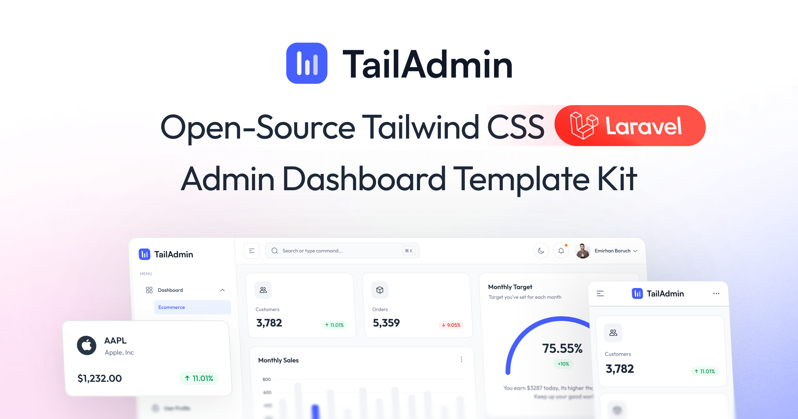

# TailAdmin Laravel - Tailwind CSS Free Laravel Dashboard

**TailAdmin Laravel** is a modern, production-ready admin dashboard template powered by **Laravel 12**, **Tailwind CSS v4**, **Alpine.js**, and a clean, modular architecture. TailAdmin is one of the most popular Tailwind CSS dashboard now also available for Larvael. It’s designed for building fast, scalable admin panels, CRM dashboards, SaaS backends, and any data-driven application where clarity and performance matter.


## Historical demo seeding

`DatabaseSeeder` requires an **empty, dedicated demo database**; it does not
append records to an existing installation. Run migrations before
`php artisan db:seed`. Do not reset a database containing real data.

The October 2026 configuration backup in `database/seeders/data/` supplies all
ten forms and the scoring rules. Its Word files were intentionally omitted.
Seeding therefore creates records only: approvals, submissions, event plans,
calendar events, workplans and account/membership state, but **no generated
documents or fabricated document paths**. Import the complete backup separately
when official templates are needed. Rules whose source form was already missing
in the backup cannot produce a tally; their source remains unresolved.

Prerequisites, from this application directory:

```bash
python3 -m venv storage/app/seed-venv
storage/app/seed-venv/bin/pip install -r database/seeders/scripts/requirements.txt
SEED_PYTHON="$PWD/storage/app/seed-venv/bin/python" php artisan db:seed
```

For Sail, run those commands inside the Laravel container. The Compose mount
exposes the repository's `.seedfiles` read-only. `SEED_ASSETS_PATH` can override
its location. Portraits are selected from `portraits/`, with compatibility for
the existing `portrait/` directory; after-event photos come from `event_photo/`.
Missing assets or the Python/Pillow runtime fail seeding explicitly.
The Python runtime is checked before any demo records are inserted. A
`Broken pipe` from an older seeder usually means Python exited early (for
example, because Pillow was missing); the generator now reads a temporary
batch file so Python failures retain their actual error output. Running plain
`php artisan` still requires `SEED_PYTHON` in the environment or `.env` unless
the default `python3` already has Pillow installed. After changing `.env`, run
`php artisan config:clear` if configuration was cached.

The data window is June 1, 2023 through October 31, 2026. One superadmin is
created first, followed by three admins (`superadmin@example.com`,
`admin1@example.com` through `admin3@example.com`; demo password `tAU100!!`).
Every account, including pending guests and faculty adviser accounts, receives
a random portrait and a unique synthetic, name-derived 100x100 JPEG signature.
These are demonstration signatures, not replicas of real people's signatures.

Each organization has 15 current officers: President, Secretary, Auditor,
Treasurer and eleven unnamed (`Others`) officers. Accepted membership requests
add **members**, not extra officers. Approved sign-ups fill reserved unnamed
officer slots. Organization pairs roll a 25% sharing chance; within successful
rolls, 10% select named/unnamed officers, 5% named/named and the remainder
unnamed/unnamed. No organization contains the same user twice.

There are exactly 50 submissions per form and 50 requests for each
request-producing form, except After Event Reports. Those have no
approval/request step: every organization files 5-10 reports against distinct
concluded events (1-2 in the running semester, so the After Event Form page
lists them), each with 2-5 distinct photos from `event_photo/`. Accepted New
Event requests are reported first; imported historical calendar activities fill
the rest without adding New Event requests or submissions. Every report is
followed by a published `Event` post that reuses the report's photos.

Approximately 70% of organizations form the workplan cohort (rounded to a whole
organization). Every organization already has a finalized workplan, approved
during the preparation period, for each semester it was active in up to the
current one; these per-semester workplans sit outside the 50-request cap. The
cohort's 50 workplan requests are for the upcoming semester (November 9, 2026),
filed in the first days of its preparation window (September 30-October 4) at 35 accepted / 5 declined /
10 pending. 25% of the cohort have an accepted upcoming workplan and then file
accreditation renewals. New Event requests keep a parent plan only when no
approved workplan covers the event's semester, as `NewEventHandler` does. The
cohort's other requests use 70% accepted / 10% declined / remaining pending;
other organizations use 30% / 10% / remaining pending. Integer acceptance quotas
are rounded per cohort, with exactly five declines per 50-request form.
Public new-organization registrations use the default 15/5/30 distribution.
Each of the 50 registrations proposes a distinct, realistically named
organization. The 15 accepted ones become organizations in addition to the 56
in `OrganizationSeeder`, for 71 in total.

Accreditation compliance follows `AccreditationService`: an organization stays
active once it has any approved accreditation request filed before the current
semester began. Every organization except the two disabled ones therefore gets
an approved founding accreditation (June 5-19, 2023). These sit outside the
50-request cap; the 25% cohort's later renewals keep the cap and the 70/10/20
ratio. The two disabled organizations never receive an approval and are
disabled on June 22, 2026, the date the daily `accreditation:enforce --disable`
job would first catch them. They file no after-event reports past that date.
Officers of a disabled organization who are also officers of an active one keep
access; the organization switcher skips suspended organizations. Only officers
whose organizations are all disabled see the suspension screen.

User-request bursts independently roll 80% for 5-8 arrivals and 30% for
12-15 arrivals on a random day in a sampled month. Both batches can occur
together; the last batch is truncated at the global 50-record form cap. Large
double-bursts use the default cohort so accepted sign-ups fit the fixed roster.
Applicable scoring criteria are chosen randomly and checked by the actual
scoring engine; pending/declined records may contain qualifying values without
contributing to an approved-record tally.

Semester schedules are seeded for school years starting in 2023 through 2030:
June 22-November 2 and November 9-March 29 of the following year. Explicit end
dates preserve the vacation gaps; existing semesters without an explicit end
retain their next-semester-derived behavior. Preparation periods run 84 days
before a first semester (March 30-June 21) and 40 days before a second semester
(September 30-November 8, overlapping the end of the first semester).

Targeted validation:
`php artisan test tests/Feature/HistoricalSeederTest.php tests/Feature/SeedSemesterCalendarTest.php`.

## Organization events

The public organization **Events** tab shows only approved activity requests
with an accepted admin approval and scheduled start/end times. It highlights
the next upcoming event with a live hours/minutes/seconds countdown and lists
event cards nearest to the current date first. Event times use the configured
display timezone. Pending, rejected, and workplan-only activities are excluded.

## Organization post viewer

Posts from accreditation-disabled or missing organizations are excluded from
public listings. Suspension keeps posts for restoration; permanent organization
purge deletes them through the existing accreditation lifecycle.

Click a post card or **View post** in an organization's feed to open a full-screen
viewer. Images appear individually on a black stage, with the organization,
publication date, title, and full description in the right-hand panel (below the
image on mobile). Use the on-screen arrows or Left/Right arrow keys to cycle through
attachments; Escape or the close button returns to the feed. Posts without media
still display their full text, and video posts retain playback controls.

In the Posts editor, a post can have up to 20 images. Click several tiles in the
Event gallery or Accomplishment Library to toggle them on or off, in the order
picked. You can also upload JPEG, PNG, or WebP files of up to 4 MB each; uploads
go after the picked images. Selected images can be reordered or removed, and the
first one becomes the cover thumbnail. A video replaces the image set. Uploaded
files are deleted when removed from a post, but shared library and gallery files
are never deleted. Existing single-image posts work without backfilling.

Deploy with `php artisan migrate` and `npm run build`. Targeted checks:
`php artisan test tests/Feature/PostImageViewerTest.php tests/Feature/PostAfterEventMediaGalleryTest.php`
and `node --test tests/js/post-viewer.test.js`.

## Quick Links

- [✨ Get TailAdmin Laravel](https://tailadmin.com/laravel)
- [📄 Documentation](https://tailadmin.com/docs)
- [⬇️ Download](https://tailadmin.com/download)
- [🌐 Live Demo](https://laravel-demo.tailadmin.com)

Here’s a tighter, more search-friendly version that highlights value and avoids fluff while keeping your structure intact.

## ✨ Key Features

- 🚀 **Laravel 12 Core** - Built on the latest Laravel release with improved routing, security, and Blade templating
- 🎨 **Tailwind CSS v4** - Utility-first styling for rapid, consistent UI development
- ⚡ **Alpine.js Interactivity** - Lightweight reactivity without a heavy JavaScript framework
- 📦 **Vite Build System** - Fast dev server, instant HMR, and optimized production builds
- 📱 **Fully Responsive Layouts** - Smooth, mobile-first design that adapts across all screen sizes
- 🌙 **Built-in Dark Mode** - Ready-to-use modern dark theme for better usability and aesthetics
- 📊 **Advanced UI Components** - Charts, data tables, forms, calendars, modals, and reusable blocks for complex dashboards
- 🎯 **Production-Ready Dashboard UI** - Clean, modern interface crafted for real apps, not placeholder demos

### Other Versions

- [Next.js Version](https://github.com/TailAdmin/free-nextjs-admin-dashboard)
- [React.js Version](https://github.com/TailAdmin/free-react-tailwind-admin-dashboard)
- [Vue.js Version](https://github.com/TailAdmin/vue-tailwind-admin-dashboard)
- [Angular Version](https://github.com/TailAdmin/free-angular-tailwind-dashboard)
- [Laravel Version](https://github.com/TailAdmin/tailadmin-laravel)

## 📋 Requirements

To set up TailAdmin Laravel, make sure your environment includes:

- **PHP 8.2+**
- **Composer** (PHP dependency manager)
- **Node.js 18+** and **npm** (for compiling frontend assets)
- **Database** - Works with SQLite (default), MySQL, or PostgreSQL

### Tailwind CSS Laravel Dashboard

TailAdmin delivers a refined Tailwind CSS Laravel Dashboard experience, combining Laravel’s robust backend with Tailwind’s flexible utility classes. The result is a clean, fast, and customizable dashboard that helps developers build modern admin interfaces without the usual front-end complexity. It’s ideal for teams looking for a Tailwind-powered Laravel starter that stays lightweight and easy to scale.

### Laravel Admin Dashboard

If you’re searching for a dependable Laravel Admin Dashboard template that’s easy to set up and ready for production, TailAdmin fits the job. It offers a polished UI, reusable components, optimized performance, and all the essentials needed to launch dashboards, CRM systems, and internal tools quickly. It gives developers a solid foundation, so projects move faster with fewer decisions to worry about.

### Check Your Environment

Verify your installations:

```bash
php -v
composer -V
node -v
npm -v
```

## 🚀 Quick Start Installation

### Step 1: Clone the Repository

```bash
git clone https://github.com/TailAdmin/tailadmin-laravel.git
cd tailadmin-laravel
```

### Step 2: Install PHP Dependencies

```bash
composer install
```

This command will install all Laravel dependencies defined in `composer.json`.

### Step 3: Install Node.js Dependencies

```bash
npm install
```

Or if you prefer yarn or pnpm:

```bash
# Using yarn
yarn install

# Using pnpm
pnpm install
```

### Step 4: Environment Configuration

Copy the example environment file:

```bash
cp .env.example .env
```

**For Windows users:**

```bash
copy .env.example .env
```

**Or create it programmatically:**

```bash
php -r "file_exists('.env') || copy('.env.example', '.env');"
```

### Step 5: Generate Application Key

```bash
php artisan key:generate
```

This creates a unique encryption key for your application.

### Step 6: Configure Database

#### Option A: Using MySQL/PostgreSQL

Update your `.env` file with your database credentials:

```env
DB_CONNECTION=mysql
DB_HOST=127.0.0.1
DB_PORT=3306
DB_DATABASE=tailadmin_db
DB_USERNAME=your_username
DB_PASSWORD=your_password
```

Create the database:

```bash
# MySQL
mysql -u root -p -e "CREATE DATABASE tailadmin_db;"

# PostgreSQL
createdb tailadmin_db
```

Run migrations:

```bash
php artisan migrate
```

### Step 7: (Optional) Seed the Database

If you want sample data:

```bash
php artisan db:seed
```

### Step 8: Storage Link

Create a symbolic link for file storage:

```bash
php artisan storage:link
```

## 🏃 Running the Application

### Development Mode (Recommended)

The easiest way to start development is using the built-in script:

```bash
composer run dev
```

This single command starts:

- ✅ Laravel development server (http://localhost:8000)
- ✅ Vite dev server for hot module reloading
- ✅ Queue worker for background jobs
- ✅ Log monitoring

**Access your application at:** [http://localhost:8000](http://localhost:8000)

### Manual Development Setup

If you prefer to run services individually in separate terminal windows:

**Terminal 1 - Laravel Server:**

```bash
php artisan serve
```

**Terminal 2 - Frontend Assets:**

```bash
npm run dev
```

### Building for Production

#### Build Frontend Assets

```bash
npm run build
```

#### Optimize Laravel

```bash
# Clear and cache configuration
php artisan config:cache

# Cache routes
php artisan route:cache

# Cache views
php artisan view:cache

# Optimize autoloader
composer install --optimize-autoloader --no-dev
```

#### Production Environment

Update your `.env` for production:

```env
APP_ENV=production
APP_DEBUG=false
APP_URL=https://yourdomain.com

# Production mail is sent through Gmail SMTP (MAIL_MAILER is ignored).
# Create an App Password at https://myaccount.google.com/apppasswords
# (requires 2-Step Verification on the account).
GMAIL_USERNAME=your.account@gmail.com
GMAIL_APP_PASSWORD="abcd efgh ijkl mnop"
```

After changing these values, run `php artisan config:cache` and restart the queue worker
(`php artisan queue:restart`) so queued mail picks up the new mailer.

## 🧪 Testing

Run the test suite using Pest:

```bash
composer run test
```

Or manually:

```bash
php artisan test
```

Run with coverage:

```bash
php artisan test --coverage
```

Run specific tests:

```bash
php artisan test --filter=ExampleTest
```

## 📜 Available Commands

### Composer Scripts

```bash
# Start development environment
composer run dev

# Run tests
composer run test

# Code formatting (if configured)
composer run format

# Static analysis (if configured)
composer run analyze
```

### NPM Scripts

```bash
# Start Vite dev server
npm run dev

# Build for production
npm run build

# Preview production build
npm run preview

# Lint JavaScript/TypeScript
npm run lint

# Format code
npm run format
```

### Artisan Commands

```bash
# Start development server
php artisan serve

# Run migrations
php artisan migrate

# Rollback migrations
php artisan migrate:rollback

# Fresh migrations with seeding
php artisan migrate:fresh --seed

# Generate application key
php artisan key:generate

# Clear all caches
php artisan optimize:clear

# Cache everything for production
php artisan optimize

# Create symbolic link for storage
php artisan storage:link

# Start queue worker
php artisan queue:work

# List all routes
php artisan route:list

# Create a new controller
php artisan make:controller YourController

# Create a new model
php artisan make:model YourModel -m

# Create a new migration
php artisan make:migration create_your_table
```

## 📁 Project Structure

```
tailadmin-laravel/
├── app/                    # Application logic
│   ├── Http/              # Controllers, Middleware, Requests
│   ├── Models/            # Eloquent models
│   └── Providers/         # Service providers
├── bootstrap/             # Framework bootstrap files
├── config/                # Configuration files
├── database/              # Migrations, seeders, factories
│   ├── migrations/
│   ├── seeders/
│   └── factories/
├── public/                # Public assets (entry point)
│   ├── build/            # Compiled assets (generated)
│   └── index.php         # Application entry point
├── resources/             # Views and raw assets
│   ├── css/              # Stylesheets (Tailwind)
│   ├── js/               # JavaScript files (Alpine.js)
│   └── views/            # Blade templates
├── routes/                # Route definitions
│   ├── web.php           # Web routes
│   ├── api.php           # API routes
│   └── console.php       # Console routes
├── storage/               # Logs, cache, uploads
│   ├── app/
│   ├── framework/
│   └── logs/
├── tests/                 # Pest test files
│   ├── Feature/
│   └── Unit/
├── .env.example           # Example environment file
├── artisan                # Artisan CLI
├── composer.json          # PHP dependencies
├── package.json           # Node dependencies
├── vite.config.js         # Vite configuration
└── tailwind.config.js     # Tailwind configuration
```

## 🐛 Troubleshooting

### Common Issues

#### "Class not found" errors

```bash
composer dump-autoload
```

#### Permission errors on storage/bootstrap/cache

```bash
chmod -R 775 storage bootstrap/cache
```

#### NPM build errors

```bash
rm -rf node_modules package-lock.json
npm install
```

#### Clear all caches

```bash
php artisan optimize:clear
```

#### Database connection errors

- Check `.env` database credentials
- Ensure database server is running
- Verify database exists

## �️ Manual Form Filling (handwritten scans)

Officers can print a partially filled request form, complete it by hand, and
upload a scan the app reads back for review before the ordinary submission runs.
Reading is done by a **host-native Ollama vision model**, kept separate from the
Gemini chat assistant and the PaddleOCR ID/waiver scanner.

**One-time host setup**

```bash
# On the Docker host (not inside a container):
ollama serve                 # or run it as a service
ollama pull qwen2.5vl:3b     # ~3B vision model, fits an 8 GB GPU
```

The Sail containers reach the daemon at `host.docker.internal:11434` (already
mapped in `compose.yaml`). Configure it in `.env` (see `.env.example`):

```dotenv
DOCUMENT_VISION_PROVIDER=ollama
DOCUMENT_VISION_URL=http://host.docker.internal:11434
DOCUMENT_VISION_MODEL=qwen2.5vl:3b
DOCUMENT_VISION_TIMEOUT=180
DOCUMENT_VISION_CONFIDENCE_THRESHOLD=0.55
```

**Requirements**

- A running **queue worker** — schema generation and scan parsing are queued
  jobs (`php artisan queue:work`, already in the Sail supervisor).
- **poppler-utils** in the app image (added to `docker/8.5/Dockerfile`) for PDF
  rasterization, and the **OCR sidecar** (`docker/ocr`) for page alignment.

**Behavior & privacy**

- The exact printed PDF is frozen per draft; parsing only reads fields that were
  blank at print time and never overwrites already-printed values.
- Extracted values are always shown for review — parsing never auto-submits.
- Passwords are never stored in a draft; sensitive/upload fields stay digital.
- If the model or OCR sidecar is down, drafts stay resumable and online
  submission is unaffected.

Abandoned drafts (and their files) are reaped after 30 days:

```bash
php artisan manual-sessions:cleanup           # scheduled daily
php artisan manual-sessions:cleanup --dry-run # preview
```

The wire contract lives in `docs/manual-form-parsing-contract.md`.

## �🔄 Update Log

### [2026-03-15]

- Fixed PHP 8.5 deprecation warning

### [2025-12-29]

- Added Date Picker in Statistics Chart

## License

Refer to our [LICENSE](https://tailadmin.com/license) page for more information.
